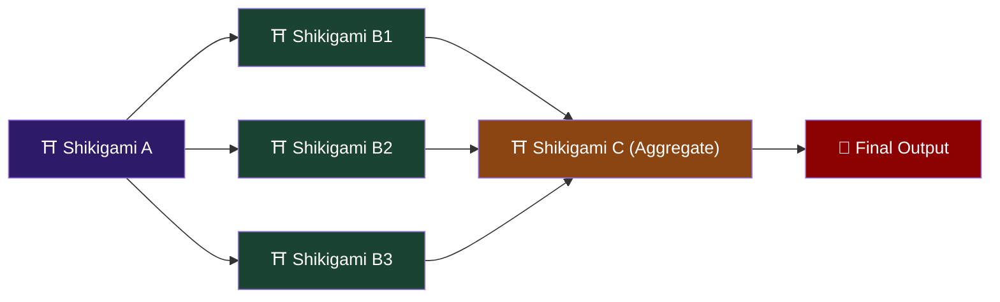
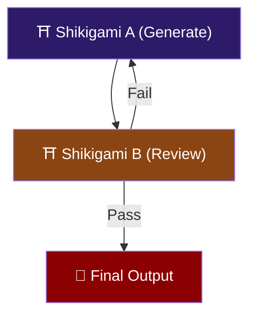
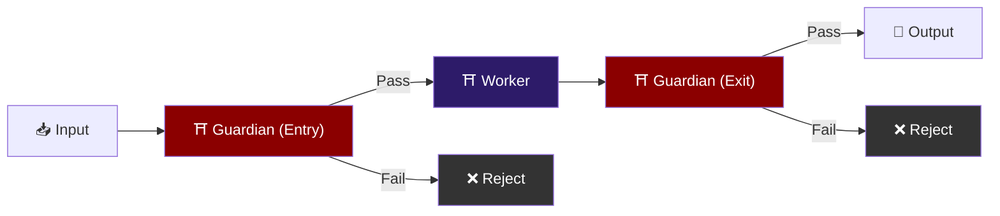
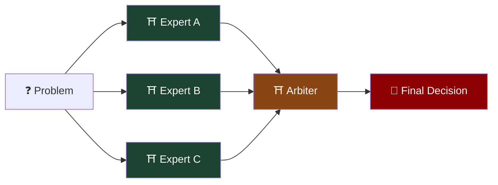
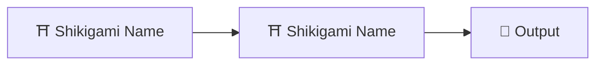

# Formation Compendium ── Multi-Agent Workflow Patterns

When multiple shikigami collaborate, selecting the right formation is crucial. Below are proven common formation patterns.

---

## Formation I: Stream Formation (Pipeline)

```
[Shikigami A] → [Shikigami B] → [Shikigami C] → Final Output
```

**Spirit-Flow Diagram**:


**Use Case**: Tasks with a clear sequential order, where each stage's output is the next stage's input.

**Typical Applications**:
- Data processing pipeline: Fetch → Clean → Transform → Load
- Code pipeline: Generate → Review → Test → Deploy
- Document processing: Extract → Translate → Format

**Implementation Notes**:
- Shikigami pass data between each other via files, with agreed intermediate formats
- Each node writes to an agreed path upon completion; the next node reads from that path
- Add checkpoints: preserve all intermediate artifacts for debugging

**Orchestrator prompt snippet**:
```
Execute the following tasks in order:
1. Invoke [Shikigami A], output to /tmp/pipeline/step1/
2. Confirm /tmp/pipeline/step1/ contains expected output files
3. Invoke [Shikigami B], reading from /tmp/pipeline/step1/, output to /tmp/pipeline/step2/
4. Confirm /tmp/pipeline/step2/ contains expected output files
5. Invoke [Shikigami C], reading from /tmp/pipeline/step2/, output to /tmp/pipeline/final/
If any step fails, halt the pipeline and report the failed step and error message.
```

---

## Formation II: Scatter Formation (Fan-out / Fan-in)

```
              ┌→ [Shikigami B1] →┐
[Shikigami A] ├→ [Shikigami B2] →┤  → [Shikigami C] (Aggregate)
              └→ [Shikigami B3] →┘
```

**Spirit-Flow Diagram**:



**Use Case**: A task that can be split into multiple independent subtasks, aggregated at the end.

**Typical Applications**:
- Multi-language translation: One document translated into multiple languages simultaneously
- Parallel testing: Running tests across multiple environments simultaneously
- Multi-angle analysis: Same data analyzed from different dimensions

**Implementation Notes**:
- Fan-out shikigami are completely independent, no interdependencies
- Each shikigami outputs to its own subdirectory
- Fan-in shikigami reads all subdirectories and aggregates
- Handle partial failure: aggregation shikigami must handle "M of N shikigami succeeded"

**Orchestrator prompt snippet**:
```
1. Invoke [Shikigami A] to prepare input data, output to /tmp/fanout/input/
2. Invoke the following shikigami in parallel (they are independent):
   - [Shikigami B1] reads from /tmp/fanout/input/, outputs to /tmp/fanout/b1/
   - [Shikigami B2] reads from /tmp/fanout/input/, outputs to /tmp/fanout/b2/
   - [Shikigami B3] reads from /tmp/fanout/input/, outputs to /tmp/fanout/b3/
3. Wait for all parallel tasks to complete
4. Invoke [Shikigami C] to aggregate /tmp/fanout/b1/, b2/, b3/ results, output to /tmp/fanout/final/
```

---

## Formation III: Rotation Formation (Iterative Refinement)

```
[Shikigami A (Generate)] → [Shikigami B (Review)] → Fail? → Back to A
                                                    → Pass? → Final Output
```

**Spirit-Flow Diagram**:



**Use Case**: Requires iterative improvement until quality standards are met.

**Typical Applications**:
- Code generation + Code Review cycle
- Copywriting + editorial review
- Design draft + user feedback revision

**Implementation Notes**:
- Set maximum iteration count (typically 3-5), prevent infinite loops
- Review shikigami must produce structured feedback (not just pass/fail — explain what and why)
- Preserve intermediate artifacts from every iteration
- Generator shikigami from the second iteration onward receives "previous version + review comments" as input

**Orchestrator prompt snippet**:
```
Iterate at most [N] times:
1. Invoke [Shikigami A] to generate/modify content, output to /tmp/iter/v{N}/draft
2. Invoke [Shikigami B] to review /tmp/iter/v{N}/draft
3. If review passes (no Critical issues), copy draft to /tmp/iter/final/ and end
4. If review fails, pass review comments along with draft as input to next iteration
5. If maximum iterations reached without passing, output the last version with all unresolved review comments
```

---

## Formation IV: Gate Formation (Gatekeeper)

```
[Input] → [Guardian (Validate)] → Pass → [Worker] → [Guardian (Validate Output)] → Output
                                 → Fail → Reject/Report
```

**Spirit-Flow Diagram**:



**Use Case**: Requires security/quality checks before and after processing.

**Typical Applications**:
- API input validation → Processing → Output validation
- Code submission → Security scan → Compliance check
- Data import → Schema validation → Data quality check

---

## Formation V: Council Formation (Expert Panel)

```
            ┌→ [Expert A (Perspective A)] →┐
[Problem] → ├→ [Expert B (Perspective B)] →┤  → [Arbiter (Synthesize)] → Final Decision
            └→ [Expert C (Perspective C)] →┘
```

**Spirit-Flow Diagram**:



**Use Case**: Need to evaluate the same problem from multiple perspectives.

**Typical Applications**:
- Technology selection: Performance expert + Security expert + Maintainability expert evaluate separately
- Risk analysis: Finance + Legal + Technical each assess risks
- Architecture decisions: Argue from scalability, simplicity, and performance perspectives

**Implementation Notes**:
- Each expert shikigami uses the same input but different prompts (emphasizing different evaluation angles)
- Arbiter shikigami needs a clear decision framework (weighted, voting, or other mechanism)
- Experts do not communicate with each other, only with the arbiter

---

## Formation Selection Guide

| Scenario | Recommended Formation |
|----------|----------------------|
| Task has clear sequential stages | Stream Formation |
| Same task needs multiple parallel processes | Scatter Formation |
| High quality requirements, needs iterative improvement | Rotation Formation |
| Pre/post processing checks needed | Gate Formation |
| Multi-perspective comprehensive decision | Council Formation |
| Combinations of the above | Nested Formations — embed sub-formations within formation nodes |

## Universal Best Practices

1. **The filesystem is the only communication channel** — shikigami should not attempt to pass complex data via stdout or environment variables
2. **Isolate each shikigami's working directory** — prevent shikigami from accidentally overwriting each other's files
3. **Preserve all intermediate artifacts** — enables debugging and backtracking
4. **Set global timeouts** — the entire formation should not run beyond a reasonable time
5. **Test small first** — run the complete formation once with simple input to confirm the flow works before scaling up

---

## Spirit-Flow Diagram Guide

Each formation includes a Mermaid spirit-flow diagram that can be used for:

1. **Visual documentation**: Paste into GitHub README or docs for automatic flowchart rendering
2. **Formation design**: When designing new formations, draw the spirit-flow diagram first to confirm data flow
3. **Debugging aid**: Mark failed nodes on the diagram to quickly locate issues

### Color Convention

| Color | Meaning |
|-------|---------|
| Deep Purple `#2d1b69` | Standard shikigami nodes |
| Deep Green `#1b4332` | Parallel-executing shikigami |
| Brown `#8b4513` | Aggregation/arbiter nodes |
| Dark Red `#8b0000` | Final output |
| Dark Gray `#333` | Rejection/failure |

### Custom Spirit-Flow Diagrams

When designing new formations, start with this Mermaid syntax:

````markdown

````
