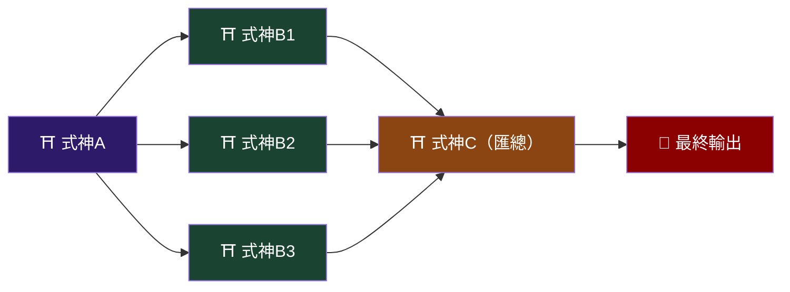
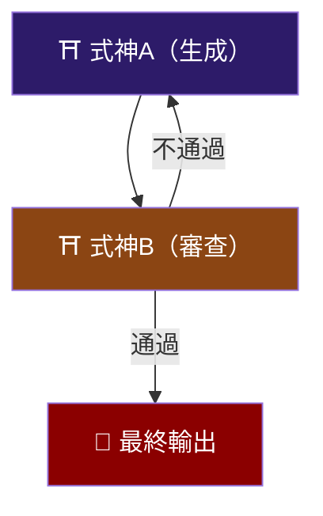
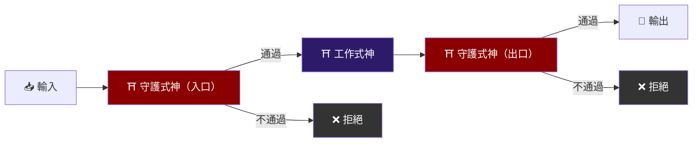
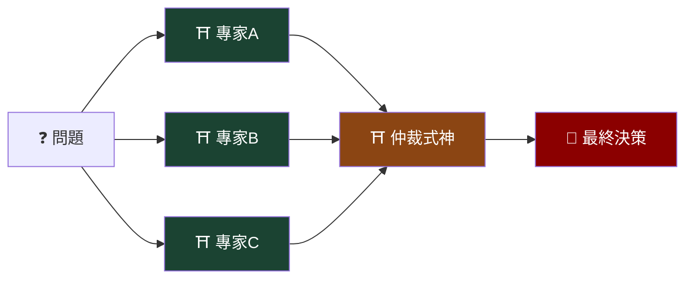
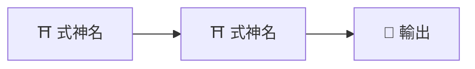

# 陣法大全 ── Multi-Agent Workflow Patterns

多式神協作時，選用合適的陣法至關重要。以下是經過驗證的常見陣法模式。

---

## 陣法一：串流陣（Pipeline）

```
[式神A] → [式神B] → [式神C] → 最終輸出
```

**靈脈圖**：


**適用場景**：任務有明確的先後順序，每個階段的輸出是下一階段的輸入。

**典型應用**：
- 資料處理流水線：抓取 → 清洗 → 轉換 → 載入
- 程式碼流水線：生成 → 審查 → 測試 → 部署
- 文件處理：提取 → 翻譯 → 排版

**實作要點**：
- 各式神之間以檔案傳遞資料，約定統一的中間格式
- 每個節點完成後寫入約定路徑，下一個節點從該路徑讀取
- 加入 checkpoint：每個中間產物都保留，方便除錯

**Orchestrator prompt 片段**：
```
依序執行以下任務：
1. 呼叫 [式神A]，輸出至 /tmp/pipeline/step1/
2. 確認 /tmp/pipeline/step1/ 中有預期的輸出檔案
3. 呼叫 [式神B]，以 /tmp/pipeline/step1/ 為輸入，輸出至 /tmp/pipeline/step2/
4. 確認 /tmp/pipeline/step2/ 中有預期的輸出檔案
5. 呼叫 [式神C]，以 /tmp/pipeline/step2/ 為輸入，輸出至 /tmp/pipeline/final/
如果任何步驟失敗，停止流水線並報告失敗步驟與錯誤訊息。
```

---

## 陣法二：散射陣（Fan-out / Fan-in）

```
           ┌→ [式神B1] →┐
[式神A] →  ├→ [式神B2] →┤  → [式神C]（匯總）
           └→ [式神B3] →┘
```

**靈脈圖**：



**適用場景**：一個任務可拆分為多個獨立子任務，最後匯總。

**典型應用**：
- 多語言翻譯：一份文件同時翻譯成多種語言
- 平行測試：同時在多個環境中跑測試
- 多角度分析：同一資料從不同維度分析

**實作要點**：
- Fan-out 階段的各式神完全獨立，互不依賴
- 每隻式神輸出到各自的子目錄
- Fan-in 式神負責讀取所有子目錄並匯總
- 考慮部分失敗：匯總式神需處理「N 隻式神中有 M 隻成功」的情況

**Orchestrator prompt 片段**：
```
1. 呼叫 [式神A] 準備輸入資料，輸出至 /tmp/fanout/input/
2. 平行呼叫以下式神（它們互不依賴）：
   - [式神B1] 從 /tmp/fanout/input/ 讀取，輸出至 /tmp/fanout/b1/
   - [式神B2] 從 /tmp/fanout/input/ 讀取，輸出至 /tmp/fanout/b2/
   - [式神B3] 從 /tmp/fanout/input/ 讀取，輸出至 /tmp/fanout/b3/
3. 等待所有平行任務完成
4. 呼叫 [式神C] 匯總 /tmp/fanout/b1/, b2/, b3/ 的結果，輸出至 /tmp/fanout/final/
```

---

## 陣法三：輪轉陣（Iterative Refinement）

```
[式神A（生成）] → [式神B（審查）] → 不通過？→ 回到式神A
                                    → 通過？→ 最終輸出
```

**靈脈圖**：



**適用場景**：需要反覆改進直到達到品質標準。

**典型應用**：
- 程式碼生成 + Code Review 循環
- 文案撰寫 + 編輯審稿
- 設計稿 + 使用者回饋修正

**實作要點**：
- 設定最大迭代次數（通常 3-5 次），避免無限循環
- 審查式神必須產出結構化回饋（不只是 pass/fail，要說明哪裡需要改、為什麼）
- 每次迭代的中間產物都要保留
- 生成式神在第二次以後要接收「上一版 + 審查意見」作為輸入

**Orchestrator prompt 片段**：
```
最多迭代 [N] 次：
1. 呼叫 [式神A] 生成/修改內容，輸出至 /tmp/iter/v{N}/draft
2. 呼叫 [式神B] 審查 /tmp/iter/v{N}/draft
3. 如果審查通過（無 Critical 問題），將 draft 複製到 /tmp/iter/final/ 並結束
4. 如果審查未通過，將審查意見與 draft 一起作為下一次迭代的輸入
5. 如果達到最大迭代次數仍未通過，輸出最後一版並附上所有未解決的審查意見
```

---

## 陣法四：看門陣（Gatekeeper）

```
[輸入] → [守護式神（驗證）] → 通過 → [工作式神] → [守護式神（驗證輸出）] → 輸出
                             → 不通過 → 拒絕/報告
```

**靈脈圖**：



**適用場景**：需要在處理前後進行安全/品質檢查。

**典型應用**：
- API 輸入驗證 → 處理 → 輸出驗證
- 程式碼提交 → 安全掃描 → 合規檢查
- 資料匯入 → schema 驗證 → 資料品質檢查

---

## 陣法五：專家會議陣（Expert Panel）

```
           ┌→ [專家式神A（視角A）] →┐
[問題] →   ├→ [專家式神B（視角B）] →┤  → [仲裁式神（綜合判斷）] → 最終決策
           └→ [專家式神C（視角C）] →┘
```

**靈脈圖**：



**適用場景**：需要從多個角度評估同一個問題。

**典型應用**：
- 技術選型：效能專家 + 安全專家 + 維護性專家分別評估
- 風險分析：財務 + 法律 + 技術各自評估風險
- 程式碼架構決策：從可擴展性、簡潔性、效能分別論證

**實作要點**：
- 各專家式神使用相同的輸入但不同的 prompt（強調不同的評估角度）
- 仲裁式神需要明確的決策框架（加權、投票、或其他機制）
- 專家之間不互相溝通，只與仲裁者溝通

---

## 陣法選擇指南

| 情境 | 推薦陣法 |
|------|---------|
| 任務有明確的階段順序 | 串流陣 |
| 同一任務需要多份平行處理 | 散射陣 |
| 品質要求高，需要迭代改善 | 輪轉陣 |
| 處理前後需要檢查 | 看門陣 |
| 需要多角度綜合決策 | 專家會議陣 |
| 以上組合 | 巢狀陣法——在陣法節點中嵌入子陣法 |

## 通用最佳實踐

1. **檔案系統是唯一的溝通管道**——式神之間不要試圖透過 stdout 或環境變數傳遞複雜資料
2. **每隻式神的工作目錄要隔離**——避免式神之間意外覆寫彼此的檔案
3. **中間產物全部保留**——方便除錯和回溯
4. **設定全域超時**——整個陣法不應該跑超過合理時間
5. **先小規模測試**——用簡單輸入跑一次完整陣法，確認流程正確後再放大規模

---

## 靈脈圖使用指南

每座陣法附有 Mermaid 格式的靈脈圖，可用於：

1. **視覺化文件**：貼入 GitHub README 或文件中，自動渲染為流程圖
2. **陣法設計**：設計新陣法時，先畫靈脈圖確認資料流向
3. **除錯輔助**：在靈脈圖上標記失敗節點，快速定位問題

### 配色慣例

| 顏色 | 含義 |
|------|------|
| 深紫 `#2d1b69` | 一般式神節點 |
| 深綠 `#1b4332` | 平行執行的式神 |
| 棕色 `#8b4513` | 匯總/仲裁節點 |
| 暗紅 `#8b0000` | 最終輸出 |
| 灰黑 `#333` | 拒絕/失敗 |

### 自訂靈脈圖

設計新陣法時，使用以下 Mermaid 語法起手：

````markdown

````
